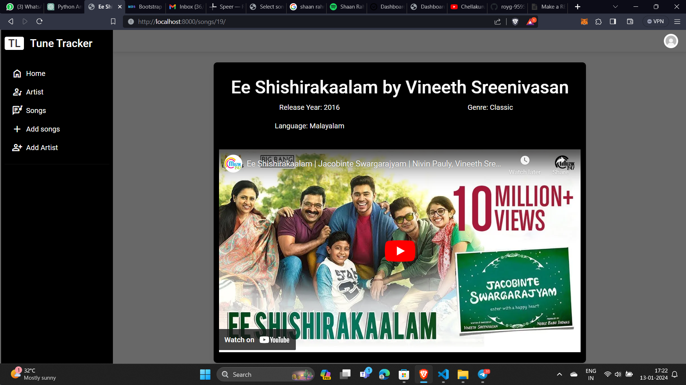

# Tune Tracker

The Favourite Songs Django Application is designed to allow users to manage and showcase their favorite songs, including information about the artists who perform them.


## Environment Setup and Project Execution

1. Clone the Repository
2. Create a Virtual Environment (Recommended)
``` bash
python -m venv venv
```
3. Activate the Virtual Environment

  On Windows:

``` bash
.\venv\Scripts\activate
```
On macOS/Linux:
``` bash
source venv/bin/activate
```
4. Install Packages
``` bash
pip install -r requirements.txt
```
5.Navigate to the Project Directory
``` bash
cd FavoriteTunes
```

6.Run Migrations
``` bash
python manage.py makemigrations
python manage.py migrate
```

6.Run server
``` bash
python manage.py runserver
```
# Screenshots
1. Dashboard


2.Artist


3. Songs


4. Video Player

5. Add Song

6. Add Artist

7. Song Detail


8.Artist Details
